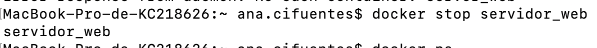
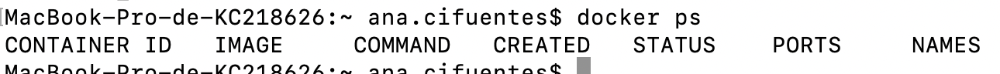
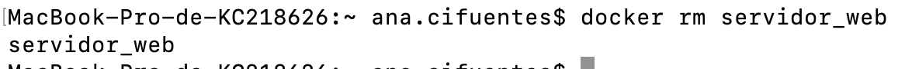
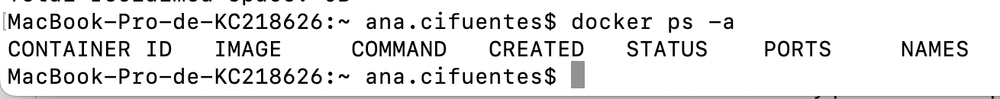

# Solución reto 01

### Para crear el contenedor se puede utilizar el siguiente script

```#!/bin/bash
# Para ejecutar el contendor a partir de la imagen nginx
docker run -d --name servidor_web -p 8181:80 nginx

# Revisar los containers que estan corriendo
docker ps

# Revisar la conectividad con el server#
curl localhost:8181
```
En la siguiente imagen se puede observar como se ejecuta el script


Aqui se puede visualizar el server corriendo


Detenemos el contenedor 


Verificamos que containers estan corriendo


Eliminamos el container 


Verificamos que se ha eliminado

